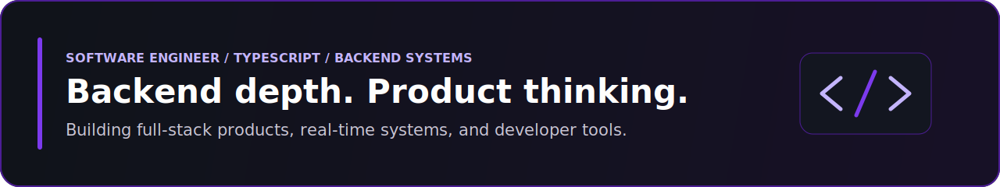

  

  Product-minded CS student building TypeScript-first software across backend systems, real-time flows, and polished frontend delivery.
   
  Most of my work lives where Bun, Hono, React, and PostgreSQL meet clean data models, auth, and cloud infrastructure.

## Experience

- **Amazon** - Software Development Engineer Intern *(Summer 2025)*
- **[Ooneex](https://www.ooneex.com/en/)** - Software Engineering Intern

## Selected Projects

<table>
  <tr>
    <td width="50%" valign="top">
      <strong><a href="https://github.com/Razvan200526/Paladin">Paladin</a></strong> 
      AI-assisted job search platform for application tracking, document workflows, analytics, and career tooling.  
      <code>Bun</code> <code>TypeScript</code> <code>React</code> <code>PostgreSQL</code> <code>TypeORM</code> <code>Cloudflare R2</code>
    </td>
    <td width="50%" valign="top">
      <strong><a href="https://github.com/Razvan200526/urbanpulse">UrbanPulse</a></strong> 
      Real-time neighborhood coordination app built around location-aware pulses, live alerts, and community response flows.  
      <code>Bun</code> <code>TypeScript</code> <code>Hono</code> <code>React</code> <code>PostGIS</code> <code>WebSockets</code>
    </td>
  </tr>
  <tr>
    <td width="50%" valign="top">
      <strong><a href="https://github.com/Razvan200526/backend_framwork">@razvan11/paladin</a></strong> 
      Decorator-based backend framework for Bun with dependency injection, controller registration, and WebSocket support.  
      <code>Bun</code> <code>TypeScript</code> <code>Hono</code> <code>Inversify</code> <code>WebSockets</code>
    </td>
    <td width="50%" valign="top">
      <strong><a href="https://github.com/Razvan200526/Cli">Framework CLI</a></strong> 
      Scaffolding CLI for generating backend primitives faster and smoothing repetitive project setup work.  
      <code>Bun</code> <code>TypeScript</code> <code>CLI</code> <code>Codegen</code> <code>Gemini</code>
    </td>
  </tr>
</table>

## Expertise

| Area | Focus |
| --- | --- |
| Backend systems | API design, auth, repository patterns, dependency injection, validation, database-backed services |
| Frontend delivery | React, Next.js, Vite, Tailwind CSS, HeroUI, user-facing product flows |
| Data and infrastructure | PostgreSQL, Redis, Docker, AWS, Cloudflare, geospatial data with PostGIS |
| Product engineering | End-to-end features, real-time notifications, developer tooling, and AI-assisted workflows |

## Core Stack

  
  
  
  
  
  
  
  

## GitHub Stats

  
  

  

